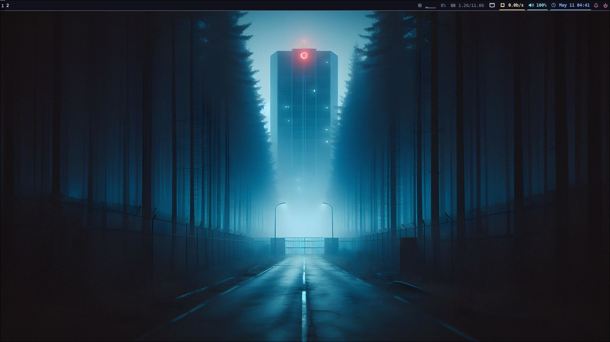
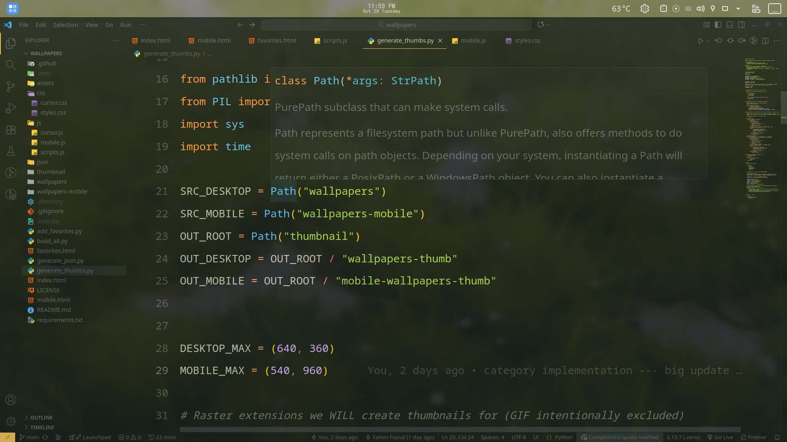
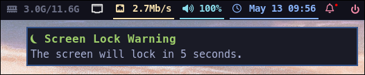
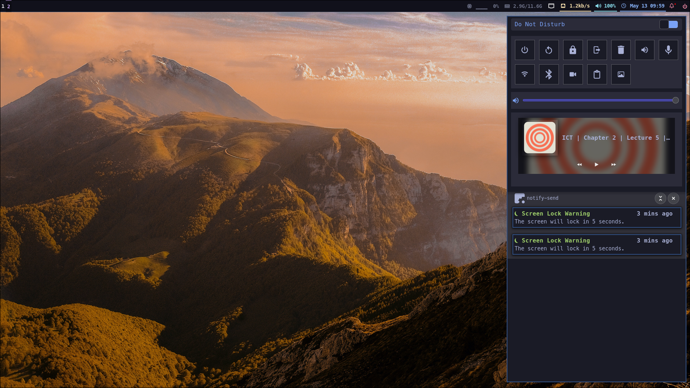
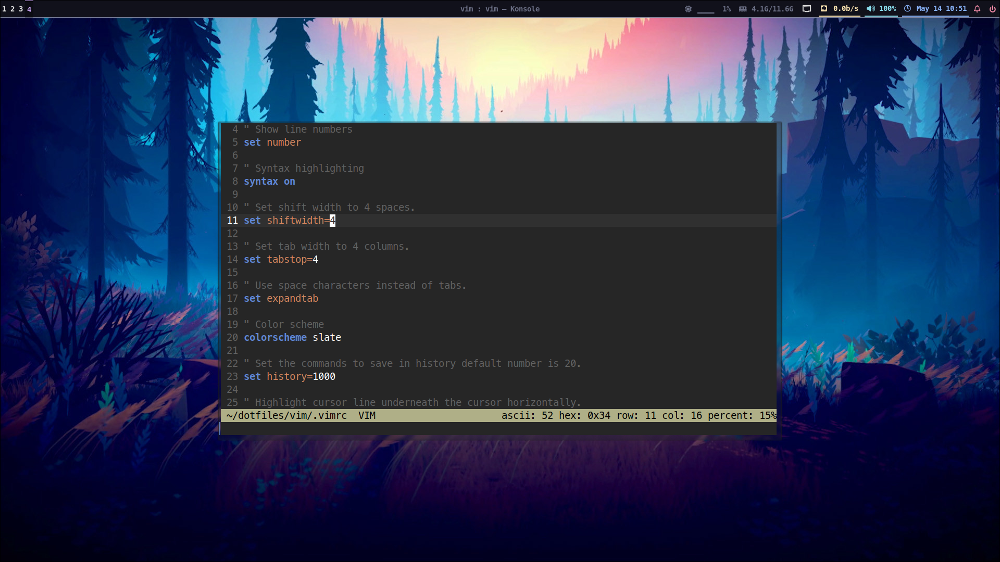
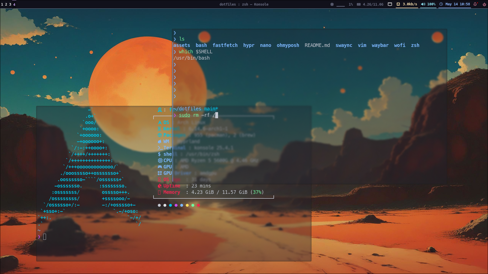
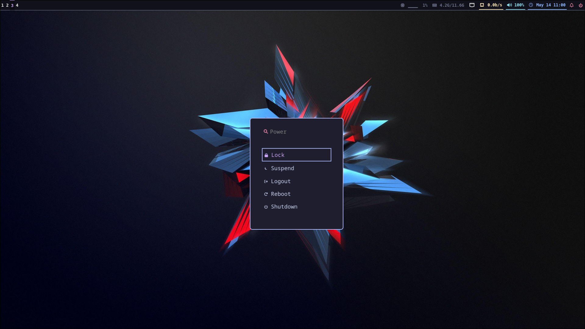
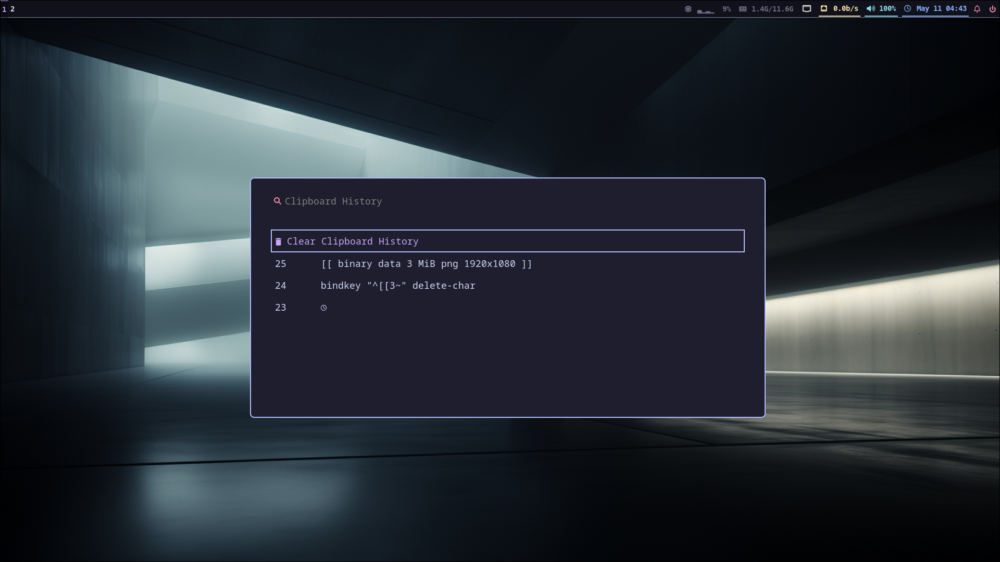

# Dotfiles

This repo contains dotfiles for my system.


## Requirements

Make sure you have stow & git installed.

```bash
pacman -S stow git
```

## Installation

#### Clone the repo in your `$HOME` diectory.

```bash
$ git clone https://github.com/fahim-foysal-097/dotfiles.git
$ cd dotfiles
```

#### Then use GNU stow to create symlinks.

To apply all configs:

```bash
stow */
```

To apply a specific configuration package:

```bash
stow <pkg_name>
```

## Screenshots

#### Locksreen (Hyprlock)


#### Waybar




#### VSCode



#### Notification center (swaync)




#### Vim



#### zsh



#### Powermenu & Clipboard



