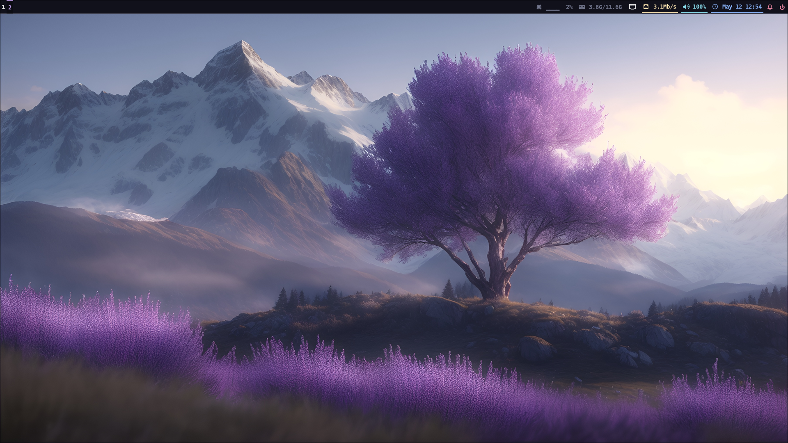

# Dotfiles

This repo contains dotfiles for my system.




## Requirements

Make sure you have stow & git installed.

```bash
pacman -S stow git
```


## Installation

#### Clone the repo in your `$HOME` diectory.

```bash
$ git clone https://github.com/dreamsofautonomy/dotfiles.git
$ cd dotfiles
```

#### Then use GNU stow to create symlinks.

To apply all configs:

```bash
stow */
```

To apply a specific configuration package:

```bash
stow <pkg_name>
```


## Screenshots


